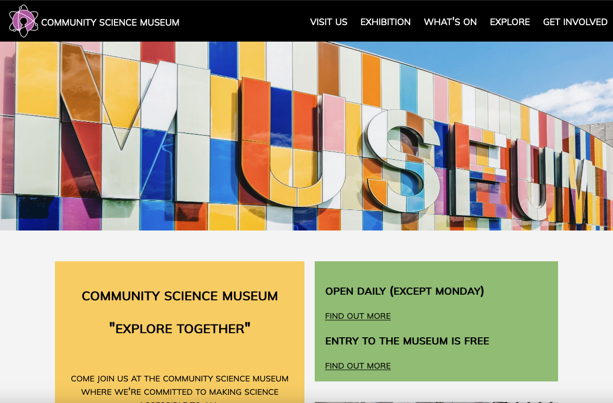

# Semester Project


## Table of Contents
* [Screenshot](#screenshot)
* [General info](#General-info)
* [Built with](#built-with)
* [Getting started](#getting-started)
* [Links](#Links) 
* [Contact](#contact)

## General info
A website for an interactive science museum called the Community Science Museum for young children. Its core target audience is primary and middle school children (ages 7-15) and families with young children.

## Built with
This project is built using:
- HTML & CSS

## Getting started
### Installing
1. Clone the repo
```
git clone https://github.com/chalund/Semesterproject-1
```
### Running
This project only contain static files, will run on all devices

## Links
[Link to site](https://voluble-frangollo-49053a.netlify.app)  
[Prototype in Figma](https://www.figma.com/file/I7F8v5JUPE8FAeW3pFbgVJ/museum?node-id=128%3A517&t=NMDVoQPO6NFRYYCo-3)

## Contact
[My Github page](https://github.com/chalund)  
[My LinkedIn page](https://www.linkedin.com/in/charlotte-lund-48419b249/)
